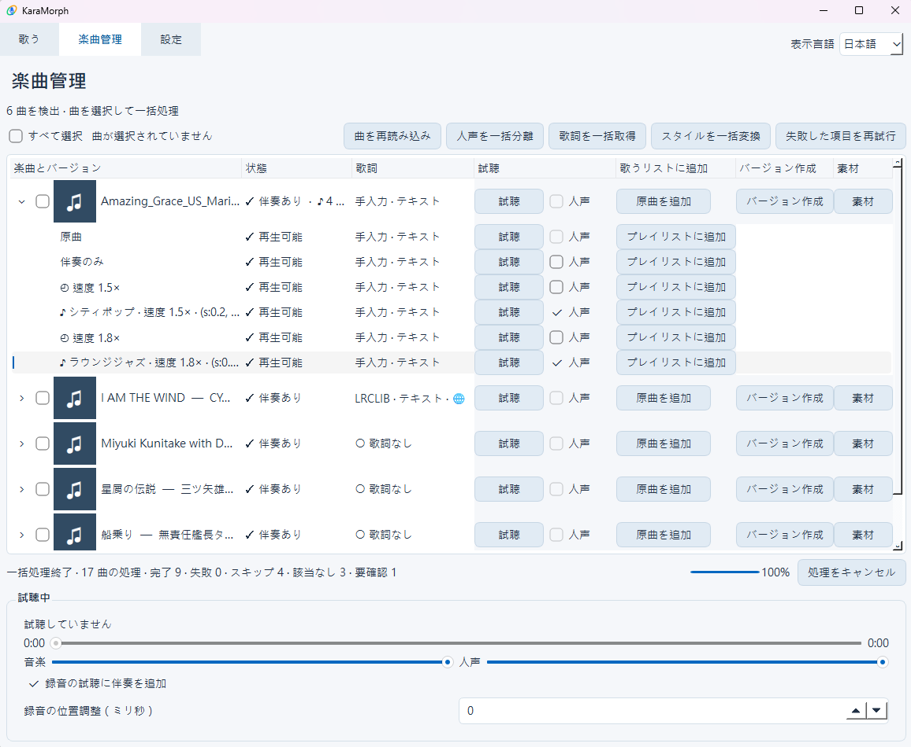
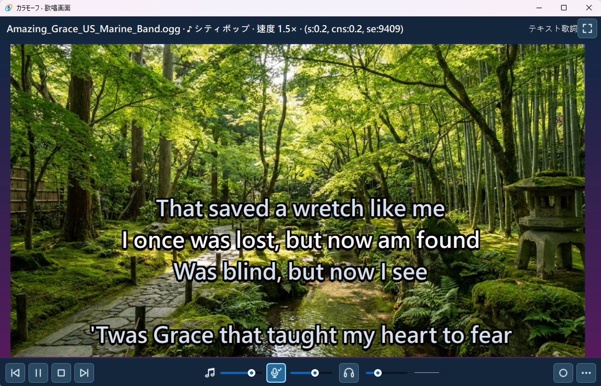

<div align="center">
  
  <h1>KaraMorph · カラモーフ</h1>
  <p>KaraMorph AIで、いつもの曲を新しいスタイルへ。</p>
  <p>好きな曲、好きなスタイル、あなただけの歌唱プレイリスト。</p>
</div>

[English](README.md) · [繁體中文](README.zh-TW.md) · [日本語](README.ja.md)

## KaraMorph を作った理由

歌いたい曲がカラオケに入っていないことがあります。いつもの曲を、違うジャンルで歌ってみたいこともあります。そんな気持ちから KaraMorph を作り始めました。既存のカラオケにも、こんなふうに自分好みに楽しめる機能があったらいいなと思っています。

### 楽曲の処理



### カラオケ再生



<sub>デモ曲：<a href="https://commons.wikimedia.org/wiki/File:Amazing_Grace_US_Marine_Band.ogg">Amazing Grace — United States Marine Band</a>。Wikimedia Commons では、この録音と John Newton による原版の英語歌詞はパブリックドメインとされています。</sub>

共通背景の既定フォルダーは `outputs/shared_images/` です（出力先を変更した場合は、そのフォルダー内）。初回利用時に同梱の背景をコピーします。画像の追加や既定画像の削除が可能で、ユーザーの画像は上書きしません。[背景画像の追加](assets/README.md)。

Windows 向けカラオケアプリ。ボーカル分離、キー・速度変更、AI スタイル変更、プレイリスト、歌詞、背景、マイク録音に対応します。繁体字中国語・英語・日本語の UI を利用できます。

## クイックスタート

MP3 を1曲ジャズ風の伴奏に変えて、歌うプレイリストに追加する例です。プログラミングや Python のインストールは不要です。

1. **ダウンロード**：[Releases](https://github.com/yceugenelai/KaraMorph/releases) を開き、使いたいバージョンの **Assets** を展開して `KaraMorph-bootstrap-poc.zip` をダウンロードします。これがアプリの配布ファイルです。
2. **展開して起動**：エクスプローラーで ZIP を右クリック →「すべて展開」を選び、例えばデスクトップの KaraMorph フォルダーへ展開します。展開したフォルダー内の `KaraMorph.exe` をダブルクリックしてください。
3. **初回セットアップ**：表示言語を選び、人声分離と ACE-Step の両方を選択したまま、画面に従って準備を開始します。インターネットに接続した状態で完了まで待ってください。ダウンロードキャッシュ込みで約35～40 GiBの空き容量が必要です。
4. **input フォルダーを設定**：`KaraMorph.exe` と同じフォルダー内に `input` フォルダーを作成します。アプリの「設定」で「音楽フォルダー」の「選択…」からこの `input` を選び、「設定を保存」を押します。出力フォルダーは既定のままで構いません。
5. **曲を1つ追加**：使用する権利のある MP3 をエクスプローラーで `input` へコピーします。例えば `私の曲.mp3` です。「楽曲管理」で「曲を再読み込み」を押すと一覧に表示されます。
6. **人声を分離**：曲の左側のチェックボックスを選び、「人声を一括分離」を押して完了を待ちます。曲名の左の矢印を開くと「伴奏のみ」が表示されます。
7. **歌詞を取得**：曲を選択したまま「歌詞を一括取得」を押します。見つからない場合は、その曲の「素材」から手動で検索するか、自分の歌詞を追加できます。歌詞がなくても再生できます。
8. **好きなスタイルに変更**：曲の「バージョン作成」を押し、「スタイル」で「ラウンジジャズ」を選びます。速度は1.0倍、キーは0のまま、「スタイル版を作成」を押して完了を待ちます。AI 処理には時間がかかる場合があります。
9. **プレイリストに追加**：曲の矢印を開き、完成したジャズ版の「プレイリストに追加」を押します。「伴奏のみ」を追加して、元の曲調で歌うこともできます。
10. **歌い始める**：「歌う」タブでプレイリストの曲を選び、「再生」を押します。伴奏と歌詞の画面が開くので、そのまま歌えます。リストを残すには「プレイリストを保存」を押してください。

## 軽量 ZIP のビルド

Windows 11 x64 でソースフォルダーから PowerShell を開き、PySide6 がインストールされた Python を指定してください（準備方法は [Python 環境とソースからの実行](docs/DEVELOPMENT.ja.md)）：

```powershell
powershell -ExecutionPolicy Bypass -File scripts/build-bootstrap-poc.ps1 -UiPython C:\path\to\python.exe
```

出力は `dist/KaraMorph-bootstrap-poc.zip` です。実行環境・モデル・個人データは含みません。ZIP 全体を別の書き込み可能なフォルダーへ展開し、その中の `KaraMorph.exe` を起動してください。既存パッケージを再ビルドする場合は `-Repack` を追加します。[ビルドの詳細](docs/BOOTSTRAP.md)。

## 初回セットアップ

軽量セットアップ ZIP 全体を書き込み可能なフォルダーへ展開し、`KaraMorph.exe` を起動してください。Python や Git の別途インストールは不要です。ZIP 内や Program Files 内では実行しないでください。

繁体字中国語・英語・日本語を選択できます。初回は英語、以降は保存した言語を使います。ボーカル分離と ACE-Step は既定で選択され、このフォルダーに Python 環境、モデル、固定版 ACE-Step ソースを準備します。両機能はキャッシュ込みで約35～40 GiB必要です。ZIP のサイズはインストール後のサイズではありません。

不要な機能は選択を外せます。基本再生にはモデル不要ですが、現在キー・速度の変更にも ACE-Step 実行環境が必要です。失敗やキャンセル時は準備済みの項目を保持し、再試行または利用可能な機能で開始できます。「設定 → インストール管理」で後から追加できます。通常の起動で未選択の機能が勝手に追加されることはありません。[セットアップとビルド](docs/BOOTSTRAP.md)。

AI 処理は NVIDIA GPU を優先します。VRAM が不足する場合や長い曲では、確認後に CPU を使用できますが、時間と大量の RAM が必要です。この版では AMD/Intel GPU の高速化には対応していません。Windows 11 x64 を主対象とし、音声デバイスは個別の動作確認が必要です。WASAPI 排他出力では他のアプリが同じデバイスを使えない場合があります。

## 日常の使い方

楽曲管理の一覧は音楽フォルダーの実際の内容に合わせて更新します。ファイルの追加・削除・移動後は「曲を再読み込み」を押してください。元の音源がなくなった曲は一覧から外れますが、処理結果・録音・素材はディスクに保持します。既存の歌うリストは利用不可と表示され、元のファイルが戻ると復元できます。永続的な除外リストは使いません。

設定・プレイリスト・ログ・キャッシュは `.app_data/`、モデルは `models/`、処理結果は既定で `outputs/` に保存します。モデルと出力先は UI で変更できます。言語変更後は再起動してください。更新は手動です。バックアップ後にデータフォルダーを保持してアプリを入れ替えてください。[制限と公開チェック](docs/RELEASE.md)も参照してください。

必要な権利を取得した音楽・歌詞・画像のみを使用してください。個人利用でも常に適法とは限りません。改変した音楽の公開には、地域の法律に応じて複製・翻案・演奏・公衆送信・録音物に関する許可などが必要になる場合があります。LRCLIB の歌詞取得は再配布許可を意味しません。

Python 環境の準備とソースからの実行は[開発ガイド](docs/DEVELOPMENT.ja.md)を参照してください。

## ライセンス

KaraMorph のプログラム開発には OpenAI ChatGPT と Codex を活用しました。

KaraMorph 独自のソースは [MIT](LICENSE) です。依存パッケージ、モデル、ネイティブ実行ファイルには別の条件があります。軽量 ZIP の[配布範囲と確認手順](docs/DISTRIBUTION.md)を別途まとめています。音源とモデルの重みは同梱しません。スクリーンショットと画像素材の出典・権利は[素材クレジット](docs/ASSET_CREDITS.md)を参照してください。

アイコンは OpenAI ChatGPT、共通背景は Google AI Studio の有料 Nano Banana Pro で生成しました。スクリーンショットは実際のアプリ画面です。[素材の出典とライセンス範囲](docs/ASSET_CREDITS.md)を参照してください。

コードと4枚の共通背景は MIT です。アイコンの権利は留保され、KaraMorph のブランド素材として提供します。スクリーンショット内の素材には個別の権利があります。[画像素材のライセンス範囲](assets/ASSET_LICENSE.md)。

メンテナーのウェブサイト：[OpticalPivot](https://www.opticalpivot.net/)。
